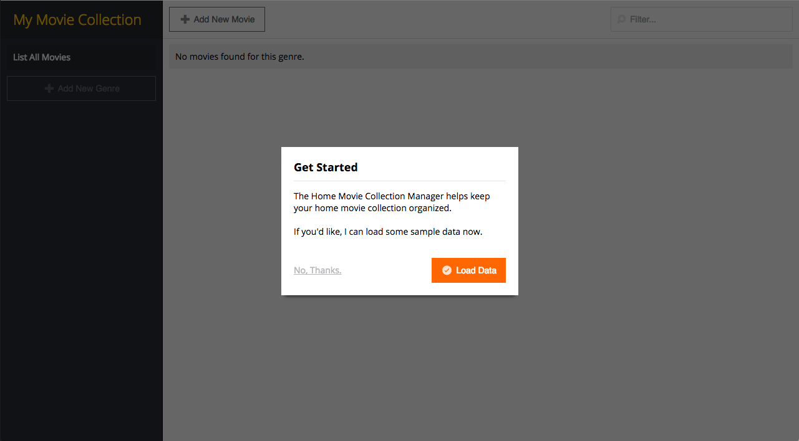
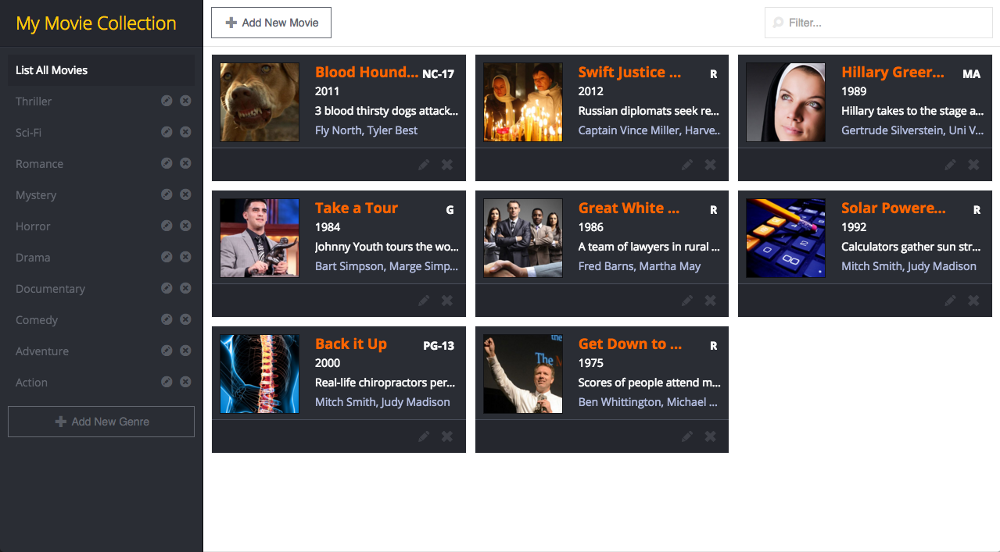
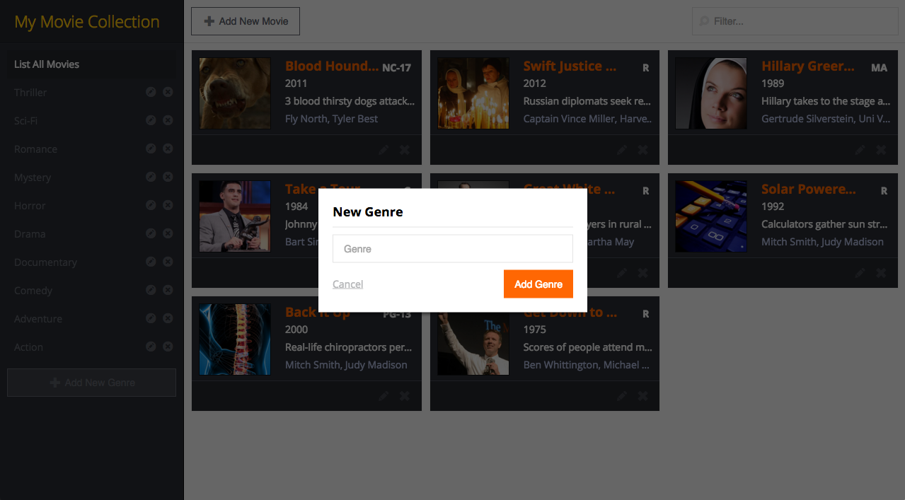
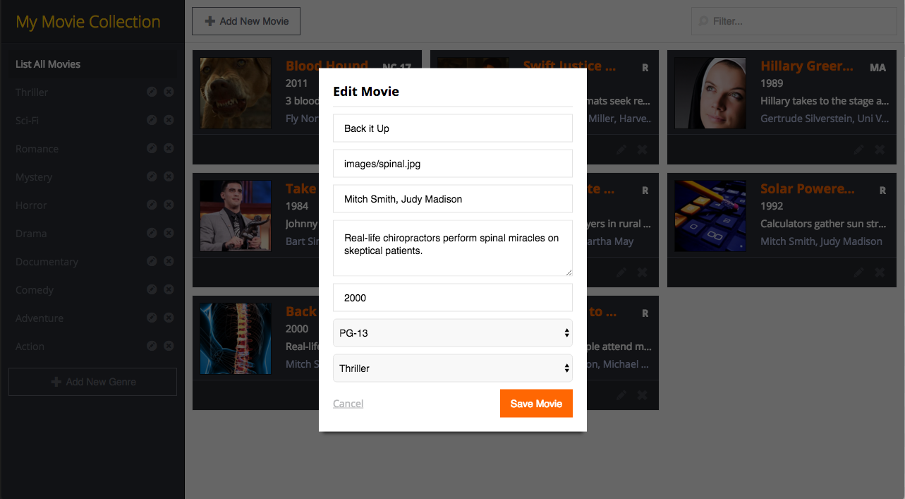
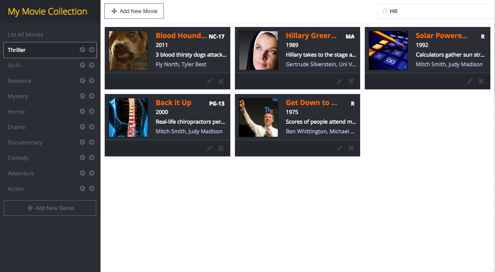
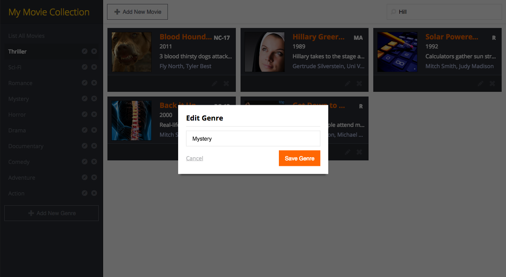

#MovieCollector

Manager your home movie collection with this multi-genre organized library with administrative functions to add/edit/delete genres and movie titles.  Add movie details like release year, actors, synopsis, etc.  Search across all fields by keywords.  Uses jquery animations on search, add, delete.

Uses JSON for data plus React (jsx structure / Views / Virtual DOM manipulation), Backbone (pub-sub / Model / local storage), Underscore, Lunr (search), and jQuery. Development environment requires Node, npm and Grunt.

##Screenshots

